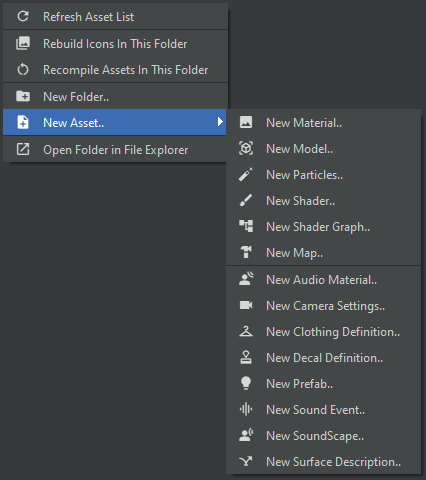

# ThirdPerson Camera

## Description

Simple third person camera component.

Uses priority stack to manage camera states.

## Usage

1. Create "Camera Settings" assets
    - "default" - default camera settings
    - any other custom settings, e.g. "aim"

2. Use CameraComponent in you code
    - Add component to your entity
        - Entity must derive from ModelEntity
        - Entity must implement WithViewAngles interface
    - Call FrameSimulate() in FrameSimulate() method
    - Use AddMode() and RemoveMode() to switch between camera modes



``` csharp
using Sandbox;
using CameraLibrary;

public class MyEntity: AnimatedEntity, WithViewAngles
{
    public CameraComponent<MyEntity> CameraComponent { get; set; }
  
    [PlayerInput]
    public Angles ViewAngles { get; set; }

    public override void ClientSpawn()
    {
        base.ClientSpawn();

        CameraComponent = Components.Create<CameraComponent<MyEntity>>();
    }

    public override void Simulate( IClient cl )
    {
        base.Simulate( cl );

        if ( Game.IsClient )
        {
            if ( Input.Pressed( "attack2" ) )
            {
                CameraComponent.AddMode( "aim" );
            }

            if ( Input.Released( "attack2" ) )
            {
                CameraComponent.RemoveMode( "aim" );
            }
        }
    }

    public override void FrameSimulate( IClient cl )
    {
        base.FrameSimulate( cl );

        CameraComponent?.FrameSimulate();
    }
}
```